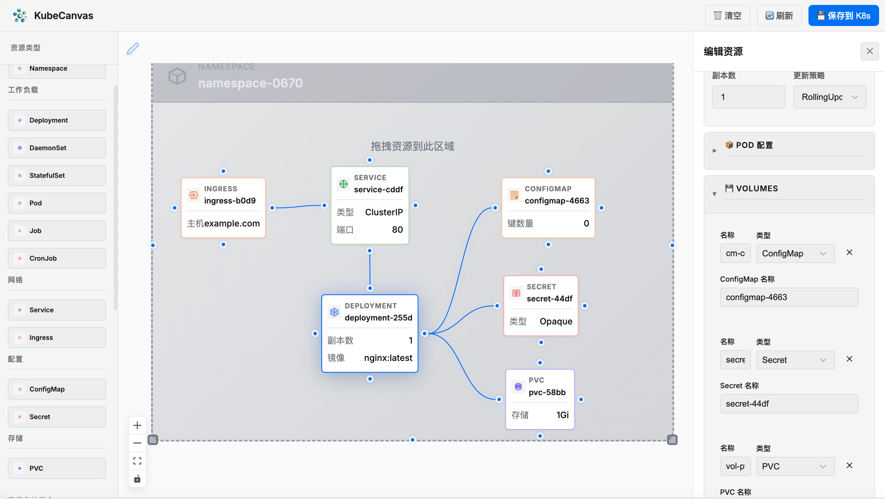

<div align="center">


# KubeCanvas

**Visual Kubernetes Resource Orchestration Tool**

[](LICENSE)
[](https://vuejs.org/)
[](https://vitejs.dev/)

[English](README.md) | [中文](README_zh.md)

</div>

---

## 📖 Introduction

**KubeCanvas** is a modern, visual Kubernetes resource orchestration tool that allows you to design and manage Kubernetes resource compositions through an intuitive drag-and-drop interface. Instead of writing complex YAML files manually, you can quickly create and connect Kubernetes resources on a visual canvas.

## ✨ Features

### 🎨 Visual Resource Editing
- **Drag & Drop**: Simply drag Kubernetes resources from the sidebar onto the canvas
- **Visual Connections**: Connect resources with intuitive connection lines to define relationships
- **Real-time Preview**: See your resource configuration in real-time

### 🔗 Smart Connection System
- **Connection Brush Tool**: Use the connection brush to easily link resources together
- **4-Point Connection**: Each resource node has 4 connection points (top, bottom, left, right)
- **Auto-routing**: Connections automatically calculate the optimal path based on node positions
- **Cancel Support**: Press ESC or right-click to cancel connection operations

### 📦 Supported Kubernetes Resources
- **Workloads**: Deployment, StatefulSet, Pod, Job, CronJob
- **Networking**: Service, Ingress
- **Configuration**: ConfigMap, Secret
- **Storage**: PersistentVolumeClaim (PVC)

### 🚀 Kubernetes Integration
- **Direct Deployment**: Save and deploy resources directly to your Kubernetes cluster
- **Composition Management**: Organize resources into compositions with unified labels
- **Load Existing**: Load and visualize existing resource compositions from your cluster

## 🖥️ Screenshots

<div align="center">

</div>

## 🛠️ Tech Stack

- **Frontend Framework**: [Vue 3](https://vuejs.org/) with Composition API
- **Build Tool**: [Vite](https://vitejs.dev/)
- **Flow Visualization**: [Vue Flow](https://vueflow.dev/)
- **HTTP Client**: [Axios](https://axios-http.com/)

## 🚀 Quick Start

### Prerequisites

- Node.js 18+
- npm or yarn
- Access to a Kubernetes cluster (optional, for deployment features)

### Installation

```bash
# Clone the repository
git clone https://github.com/yourusername/KubeCanvas.git
cd KubeCanvas

# Install dependencies
npm install

# Start development server
npm run dev
```

The application will be available at `http://localhost:5173`

### Deploy to Kubernetes Cluster

For quick deployment to an existing Kubernetes cluster:

```bash
# Clone the repository
git clone https://github.com/luogangyi/KubeCanvas.git
cd KubeCanvas

# Deploy RBAC, Deployment, and NodePort Service
kubectl apply -f deploy/01-rbac.yaml
kubectl apply -f deploy/02-deployment.yaml
kubectl apply -f deploy/03-service-nodeport.yaml

# Access the application
# http://<kubernetes-node-ip>:30073
```

> **Note**: Replace `<kubernetes-node-ip>` with your Kubernetes node IP (can be the API Server IP).

### Configuration

To connect to your Kubernetes cluster, create `.env.local` file:

```javascript
export default {
  apiServer: 'https://your-k8s-api-server:6443',
  token: 'your-service-account-token',
  namespace: 'default'
}
```

## 📖 Usage Guide

### Creating Resources

1. **Add Resources**: Drag resources from the left sidebar onto the canvas
2. **Configure Properties**: Click on a resource to open the properties panel
3. **Edit Settings**: Modify resource properties like name, replicas, image, etc.

### Connecting Resources

1. **Using Connection Brush**: 
   - Click and drag the "Connection Brush" tool from the toolbar
   - Drag to the source node, then continue to the target node
   - Release to create the connection

2. **Using Connection Points**:
   - Hover over a node to see connection points (small circles)
   - Click and drag from a connection point to another node
   - Release on the target node or its connection point

### Deploying to Kubernetes

1. Design your resource composition on the canvas
2. Click "💾 Save to K8s" button
3. Resources will be created with unified labels for easy management

### Managing Compositions

- **Refresh**: Click "🔄 Refresh" to load existing compositions from cluster
- **Load**: Click on a composition in the sidebar to load it onto the canvas
- **Clear**: Click "🗑️ Clear" to reset the canvas

## 📁 Project Structure

```
KubeCanvas/
├── src/
│   ├── components/
│   │   ├── Canvas.vue          # Main canvas component
│   │   ├── Sidebar.vue         # Resource sidebar
│   │   ├── PropertyPanel.vue   # Properties editor
│   │   └── nodes/
│   │       └── BaseNode.vue    # Base resource node component
│   ├── composables/
│   │   └── useK8sApi.js        # Kubernetes API composable
│   ├── config/
│   │   └── k8s.js              # K8s configuration
│   ├── utils/
│   │   └── resourceTemplates.js # Resource YAML templates
│   ├── App.vue                 # Root component
│   ├── main.js                 # Application entry
│   └── style.css               # Global styles
├── index.html
├── vite.config.js
└── package.json
```

## 🤝 Contributing

Contributions are welcome! Please feel free to submit a Pull Request.

1. Fork the repository
2. Create your feature branch (`git checkout -b feature/AmazingFeature`)
3. Commit your changes (`git commit -m 'Add some AmazingFeature'`)
4. Push to the branch (`git push origin feature/AmazingFeature`)
5. Open a Pull Request

## 📄 License

This project is licensed under the Apache License 2.0 - see the [LICENSE](LICENSE) file for details.

## 🙏 Acknowledgments

- [Vue Flow](https://vueflow.dev/) - For the excellent flow visualization library
- [Kubernetes](https://kubernetes.io/) - For the amazing container orchestration platform
- All contributors who help improve this project

---

<div align="center">
Made with ❤️ for the Kubernetes community
</div>
