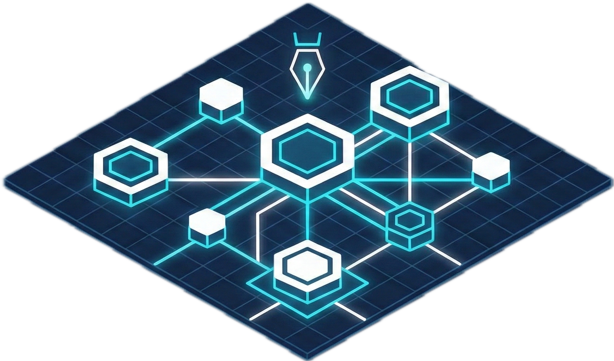
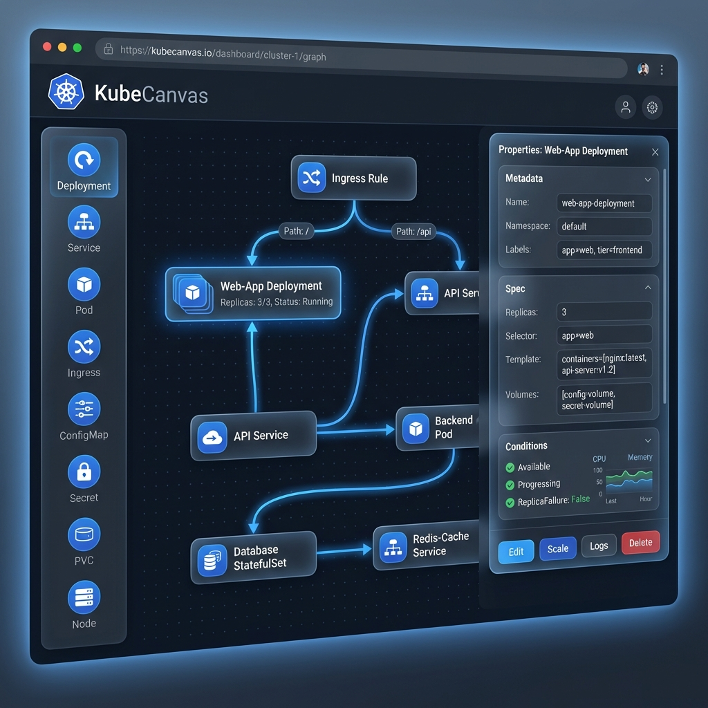

<div align="center">



# KubeCanvas

**可视化 Kubernetes 资源编排工具**

[](LICENSE)
[](https://vuejs.org/)
[](https://vitejs.dev/)

[English](README.md) | [中文](README_zh.md)

</div>

---

## 📖 简介

**KubeCanvas** 是一款现代化的可视化 Kubernetes 资源编排工具，让您能够通过直观的拖拉拽界面来设计和管理 Kubernetes 资源组合。无需手动编写复杂的 YAML 文件，您可以在可视化画布上快速创建和连接 Kubernetes 资源。

## ✨ 功能特性

### 🎨 可视化资源编辑
- **拖拉拽操作**：从侧边栏拖动 Kubernetes 资源到画布上
- **可视化连线**：通过直观的连线来定义资源之间的关系
- **实时预览**：实时查看资源配置

### 🔗 智能连线系统
- **连线画笔工具**：使用连线画笔轻松连接资源
- **四点连接**：每个资源节点有 4 个连接点（上、下、左、右）
- **自动路由**：连线根据节点位置自动计算最优路径
- **取消支持**：按 ESC 键或右键点击取消连线操作

### 📦 支持的 Kubernetes 资源
- **工作负载**：Deployment、StatefulSet、Pod、Job、CronJob
- **网络**：Service、Ingress
- **配置**：ConfigMap、Secret
- **存储**：PersistentVolumeClaim (PVC)

### 🚀 Kubernetes 集成
- **直接部署**：将资源直接保存并部署到 Kubernetes 集群
- **组合管理**：使用统一标签组织资源组合
- **加载已有资源**：从集群加载并可视化已有的资源组合

## 🖥️ 界面截图

<div align="center">

</div>

## 🛠️ 技术栈

- **前端框架**：[Vue 3](https://vuejs.org/) + Composition API
- **构建工具**：[Vite](https://vitejs.dev/)
- **流程可视化**：[Vue Flow](https://vueflow.dev/)
- **HTTP 客户端**：[Axios](https://axios-http.com/)

## 🚀 快速开始

### 前置条件

- Node.js 18+
- npm 或 yarn
- Kubernetes 集群访问权限（可选，用于部署功能）

### 安装

```bash
# 克隆仓库
git clone https://github.com/yourusername/KubeCanvas.git
cd KubeCanvas

# 安装依赖
npm install

# 启动开发服务器
npm run dev
```

应用将在 `http://localhost:5173` 上运行

### 配置

要连接到您的 Kubernetes 集群，请更新 `src/config/k8s.js` 中的配置：

```javascript
export default {
  apiServer: 'https://your-k8s-api-server:6443',
  token: 'your-service-account-token',
  namespace: 'default'
}
```

## 📖 使用指南

### 创建资源

1. **添加资源**：从左侧边栏拖动资源到画布
2. **配置属性**：点击资源打开属性面板
3. **编辑设置**：修改资源属性，如名称、副本数、镜像等

### 连接资源

1. **使用连线画笔**：
   - 从工具栏点击并拖动"连线画笔"工具
   - 拖动到源节点，然后继续拖到目标节点
   - 释放鼠标创建连接

2. **使用连接点**：
   - 悬停在节点上可看到连接点（小圆点）
   - 从连接点点击并拖动到另一个节点
   - 在目标节点或其连接点上释放

### 部署到 Kubernetes

1. 在画布上设计您的资源组合
2. 点击"💾 保存到 K8s"按钮
3. 资源将以统一标签创建，便于管理

### 管理资源组合

- **刷新**：点击"🔄 刷新"从集群加载已有组合
- **加载**：点击侧边栏中的组合将其加载到画布
- **清空**：点击"🗑️ 清空"重置画布

## 📁 项目结构

```
KubeCanvas/
├── src/
│   ├── components/
│   │   ├── Canvas.vue          # 主画布组件
│   │   ├── Sidebar.vue         # 资源侧边栏
│   │   ├── PropertyPanel.vue   # 属性编辑器
│   │   └── nodes/
│   │       └── BaseNode.vue    # 基础资源节点组件
│   ├── composables/
│   │   └── useK8sApi.js        # Kubernetes API 组合式函数
│   ├── config/
│   │   └── k8s.js              # K8s 配置
│   ├── utils/
│   │   └── resourceTemplates.js # 资源 YAML 模板
│   ├── App.vue                 # 根组件
│   ├── main.js                 # 应用入口
│   └── style.css               # 全局样式
├── index.html
├── vite.config.js
└── package.json
```

## 🤝 参与贡献

欢迎贡献！请随时提交 Pull Request。

1. Fork 本仓库
2. 创建特性分支 (`git checkout -b feature/AmazingFeature`)
3. 提交更改 (`git commit -m '添加某个很棒的特性'`)
4. 推送到分支 (`git push origin feature/AmazingFeature`)
5. 发起 Pull Request

## 📄 许可证

本项目采用 Apache License 2.0 许可证 - 详情请参阅 [LICENSE](LICENSE) 文件。

## 🙏 致谢

- [Vue Flow](https://vueflow.dev/) - 优秀的流程可视化库
- [Kubernetes](https://kubernetes.io/) - 强大的容器编排平台
- 所有帮助改进本项目的贡献者

---

<div align="center">
用 ❤️ 为 Kubernetes 社区打造
</div>
